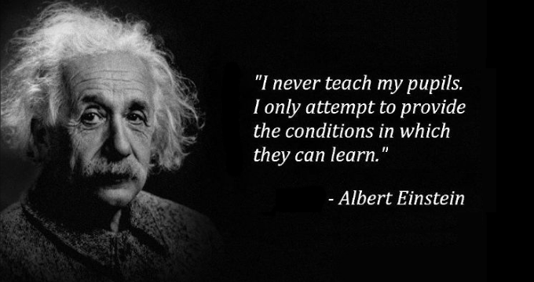

## Rolling Scopes School

**Rolling Scopes School** - бесплатные онлайн-курсы, проводимые сообществом разработчиков The Rolling Scopes с 2013 года. В RS School может учиться каждый, независимо от возраста, профессии, места жительства. Один из базовых принципов RS School: "Мы не учим, мы создаём условия для вашего обучения". Такой подход позволяет каждому учиться в индивидуальном темпе, с максимальной самоотдачей, быстро и результативно усваивать необходимые навыки. За полгода интенсивных занятий хорошо успевающие студенты курса приобретают достаточно знаний и опыта для смены профессии. 

RS School предоставляет: 
- учебную программу
- среду для общения
- платформу для организации учебного процесса.  

RS School объединяет несколько курсов по фронтенду. Проходить их лучше последовательно и стартуют они друг за другом два раза в год.

- stage#0 - подготовительный курс, который позволит понять подходит ли вам принятый в RS School формат обучения, способны ли вы учиться самостоятельно, организовывать собственную деятельность, искать необходимую информацию, достигать нужного результата.  
stage#0 предназначен для тех, кто только начинает изучать программирование.  
На этапе stage#0 студенты знакомятся с платформой rs app, проходят несколько тестов, выполняют таск по вёрстке, создают несколько небольших js-приложений.  
Продолжительность stage#0 - 10-12 недель/  
- stage#1 - первый этап, сюда приходят как те, кто прошёл stage#0, так и студенты, которые изучали программирование самостоятельно. Программа похожа на stage#1, но макет для вёрстки предлагатся больше и сложнее, то же относится и к таску/таскам по js.  
- Студенты, успешно выполнившие задания stage#1 проходят собеседование с ментором и переходят в stage#2. По результатам собеседования определяется будут ли они учиться на stage#2 с ментором или самостоятельно.  
В stage#2 вёрстки нет, упор делается на изучение JavaScript и TypeScript, студенты выполняют несколько приложений на js/ts и финальный командный проект.  
Продолжительность stage#1 и stage#2 - 22-24 недели/  
- Курс по фреймворкам (react или angular на выбор студента) знакомит с выбранным фреймворком или библиотекой и позволяет выполнить несколько проектов на нём, или один проект, состоящий из нескольких частей.  
Продолжительность курса по фреймворкам - 10-12 недель.  
- node.js изучается 10 недель. За это время студенты выполняют проекты по node.js. Также есть курс node.js + AWS Cloud, на котором студенты учатся работать с облачными базами данных.

## Трудоустройство

RS School не гарантирует трудоустройство, но после stage#2, курса по фреймворкам, курса по node.js студентов приглашают на собеседования в epam js lab. Для того, чтобы попасть на такое собеседование, нужно отвечать требованиям: находиться в топе, для разных локаций топ разный, от топ-100 до топ-400 и ниже; знать английский язык на уровне не ниже А2 или В1, в зависимости от локации, быть готовым к фулл-тайм работе. 

Для того, чтобы успешно учиться в RS School, нужно понимать что данный курс собой представляет, какие особенности учебного процесса, как общаться с другими студентами, с менторами, админами курса, как выполнить задание, как отправить задание на проверку, как проверить задания других студентов.

Ответы на большинство вопросов даёт [документация курса](https://docs.rs.school/) с поправкой на то, что учебный процесс динамичный и документация не всегда успевает за изменениями курса.

Кроме того желательно посмотреть вступительные видео, познакомиться с [расписанием курса](https://docs.google.com/spreadsheets/d/1oM2O8DtjC0HodB3j7hcIResaWBw8P18tXkOl1ymelvE/htmlview#), с [учебной платформой курса](https://app.rs.school/), почитать [отзывы студентов предыдущих наборов](https://docs.google.com/spreadsheets/d/1UZxoOstzqK6NPKvEROS2X86R5yyINC8gj9ypGERwphQ/).

## Материалы

- [Видео о курсе](https://youtu.be/TkQS7Ej6zVs)
- [Документация курса](https://docs.rs.school/)
- [2020q1 Feedback о школе](https://docs.google.com/spreadsheets/d/1UZxoOstzqK6NPKvEROS2X86R5yyINC8gj9ypGERwphQ/)
- [Расписание курса](https://docs.google.com/spreadsheets/d/1oM2O8DtjC0HodB3j7hcIResaWBw8P18tXkOl1ymelvE/htmlview#)
- [rs app - учебная платформа курса](https://app.rs.school/)
- [YouTube канал курса](https://www.youtube.com/channel/UCUgmHbk1rTFaf4GGKQ1OXfQ)