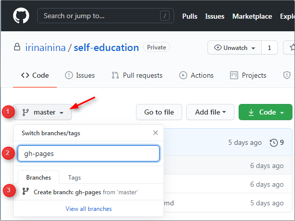

## Работа с Git

Разработчику необходимо освоить базовые приёмы работы с Git и GitHub.  
Ниже приводится перечень действий с Git и GitHub, которые нужно уметь выполнять. Если они не составляют для вас проблемы, можно сразу переходить к выполнению заданий. Если возникают вопросы, клик по стрелке рядом с пунктом списка позволит ознакомиться с ним подробнее. При этом рекомендуется не только прочитать последовательность действий, но и выполнить их самостоятельно.

1. 

     
Регистрация на GitHub

     GitHub https://github.com/  
     Видео: [Регистрация на сервисе GitHub](https://youtu.be/5DKVktUtH3A)

   

2. 

     
Создание репозитория

     Для cоздания репозитория кликните на кнопку New repository справа вверху.  
     На странице создания репозитория https://github.com/new укажите:  
     - название репозитория  
     - настройки видимости (приватный это репозиторий или публичный)  
     - поставьте галочку, чтобы создать README файл  
     Видео: [Создание репозитория на сервисе GitHub](https://youtu.be/CgFHLQBwj7A)
   

3. 

     
Клонирование репозитория на компьютер

     Репозиторий в виде папки у вас на компьютере называется локальный репозиторий.  
     Репозиторий, загруженный на GitHub, называется удалённый репозиторий.       
     Когда вы клонируете себе на компьютер репозиторий с GitHub, вы создаёте **локальную копию удалённого репозитория**.  

     Команда для клонирования репозитория  
     `git clone ссылка на репозиторий`

     Например, чтобы склонировать себе на компьютер репозиторий с тасками курса https://github.com/rolling-scopes-school/tasks, необходимо открыть **Git Bash** и выполнить в нём команду  
     `git clone https://github.com/rolling-scopes-school/tasks`

     Если необходимо склонировать себе на компьютер отдельную ветку репозитория, выполните команду  
     `git clone ссылка на репозиторий -b название ветки`

   

4. 

     
Загрузка файлов в репозиторий

     Загрузить файлы в репозиторий можно как через GitHub, так и через Git. Рассмотрим оба варианта
     
     #### Загрузка файлов в репозиторий через интерфейс GitHub 
      - кликаете на кнопку **Add file** справа вверху
      - выбираете **Upload files**
      - в появившееся окно перетягиваете файлы и папки с проектом

   #### Загрузка файлов в репозиторий через Git 
      - клонируете репозиторий себе на компьютер. Для этого в Git Bash выполняете команду  
      `git clone ссылка на репозиторий`
      - перетягиваете в папку репозитория файлы и папки с проектом
      - индексируете изменения. Для этого выполняете команду  
      `git add .` (с точкой в конце)
      - коммитите изменения. Для этого выполняете команду  
      `git commit -m "пишете что изменили"`
      - загружаете файлы в репозиторий. Для этого выполняете команду  
      `git push origin main` , здесь `main` - название ветки репозитория, в которую пушите изменения
   
   
5. 

     
Создание веток

     Главная ветка репозитория по умолчанию называется `main` (раньше `master`).  
     От неё можно создавать другие ветки, от них ещё ветки и т.д.  
     На первых этапах учёбы все ветки создаются исключительно от главной ветки. Перед созданием новой ветки убедитесь, что вы находитесь в главной ветке репозитория.  
     Создать ветку можно как через GitHub, так и через Git. Рассмотрим оба варианта. 
     
     #### Создание ветки через интерфейс GitHub 
     1. Убедитесь, что вы находитесь в главной ветке репозитория `main` (раньше - `master`)
     2. Кликните на треугольник рядом с названием ветки. В текстовое поле впишите название ветки, например, `gh-pages`
     3. Нажмите на строку `Create branch: gh-pages from main` (or from `master`).  
     Мы создали ветку `gh-pages`.

     

   #### Создание ветки при помощи Git 
      - Клонируем репозиторий себе на компьютер    
     `git clone ссылка на репозиторий`  
     - Находясь в папке репозитория открываем Git Bash и выполняем команду  
     `git checkout -b gh-pages`  
     Мы создали ветку `gh-pages` и перешли в неё.  
     - Обратите внимание, при создании ветки в неё копируются все файлы той ветки, от которой её создали.
   

6. 

     
Создание Pull Request

     В ходе выполнения проектов в RS School вы чаще всего будете делать Pull Request из ветки разработки в главную ветку своего репозитория `main` или `master`, а также из ветки разработки в ветку `gh-pages`.  

     Pull Request создаётся через интерфейс GitHub. Для этого  
     - выберите ветку разработки
     - нажмите на вкладку **Pull Request** вверху слева
     - нажмите на кнопку **Compare & pull request** справа вверху. Такая кнопка появится если в ветке разработки есть изменения по сравнению с другими ветками репозитория, хоть лишняя точка в файле README
     - укажите из какой ветки репозитория в какую делаете Pull Request
     - нажмите на зелёную кнопку внизу **Create pull request**.  
     Вы открыли Pull Request. В таком виде его и оставьте. В открытом Pull Request ментору будет удобно проверять код. Обратите внимание, что к Pull Request можно и нужно добавить описание. [Описание pull request должно содержать следующую информацию](https://docs.rs.school/#/pull-request-review-process?id=Описание-pull-request-должно-содержать-следующую-информацию)
     - Если нажать на кнопку **Merge pull request**, Pull Request закроется, при этом файлы из ветки разработки переместятся в ту ветку, в которую делаете Pull Request.
   

   
7. 

     
Деплой на gh-pages

     Деплой это размещение в интернете вашего проекта - сайта или приложения. 
     Предположим, весь наш проект - файл index.html с содержимым  
     `<h1>Hello world</h1>`

     Загрузите его в ветку gh-pages удалённого репозитория (репозиторий должен быть публичным).  
     Загрузить файл в репозиторий можно как через GitHub, так и через Git (см. п.4). 
     
     При загрузке файлов через Git последовательно выполняем команды:  
     `git add .`  
     `git commit -m "feat: add file to gh-pages"`  
     `git push origin gh-pages`  

     При создании в публичном репозитории ветки gh-pages, GitHub автоматически размещает её содержание в интернете. То есть, если репозиторий публичный, в нём есть ветка gh-pages, и в корне этой ветки находится файл index.html, этот файл уже размещён в интернете. Всё, что осталось сделать, найти ссылку на него.  
     
     Идём в настройки репозитория (шестерёнка с надписью Settings справа вверху)

     

     Прокручиваем до пункта GitHub Pages. Если здесь уже находится выделенная зелёным цветом ссылка на созданную страницу, больше ничего делать не нужно, GitHub Pages создана. Если нет, подождите несколько минут, GitHub Pages создаётся не мгновенно.

     

     Ссылка на GitHub Pages имеет вид:  
     `https://github-name.github.io/repository-name`,  
     здесь  
     `github-name` - username пользователя GitHub  
     `repository-name` - название репозитория
   

   
8. 

     
Деплой на netlify

     Если необходимо разместить в интернете проект, созданный в приватном репозитории, можно использовать сервис https://www.netlify.com/ Для этого авторизуемся на netlify, нажимаем на кнопку New site from Git и указываем репозиторий на GitHub, где находится наше приложение.

     Также netlify позволяет разместить приложение, код которого находится в локальной папке на компьютере. Для этого достаточно открыть страницу https://app.netlify.com/drop и перетянуть папку с кодом приложения в прямоугольник с надписью "Drag and drop your site". Как и при деплое на GitHub Pages, деплой приложения на Netlify возможен, если файл index.html находится в корне папки с проектом.
     
     
   

## Материалы
- [Как установить Git и работать в консоли](https://youtu.be/dnrcpHcJyVo)
- [Как сделать репозиторий из любого проекта](https://youtu.be/FTF1qTs6_LU)
- [Что делать, если всё пошло не так](https://youtu.be/sUKpPY9-tsA)
- [Зачем и как создавать ветки](https://youtu.be/9UwBPPw47Z4)
- [Конспект по Git](https://www.evernote.com/shard/s368/client/snv?noteGuid=b1359883-2b9e-419a-b9de-dd959fc05f05&noteKey=97c0f19486d851b3&sn=https%3A%2F%2Fwww.evernote.com%2Fshard%2Fs368%2Fsh%2Fb1359883-2b9e-419a-b9de-dd959fc05f05%2F97c0f19486d851b3&title=Git)
- [Git и GitHub Курс Для Новичков](https://youtu.be/zZBiln_2FhM)
- [Курс по работе с git Ильи Кантора. 50 видео от простого к сложному](https://www.youtube.com/playlist?list=PLDyvV36pndZFHXjXuwA_NywNrVQO0aQqb)
- [Git - Lecture](https://youtu.be/QlgZZkowIOc)
- [Git Workshop](https://youtu.be/HAycH-eN6fI)
- [Основы Git. Учебник](https://git-scm.com/book/ru/v2/Введение-О-системе-контроля-версий)
- [Интерактивный курс Git How To](https://githowto.com/ru)
- [Интерактивный курс по Git](https://learngitbranching.js.org/)
