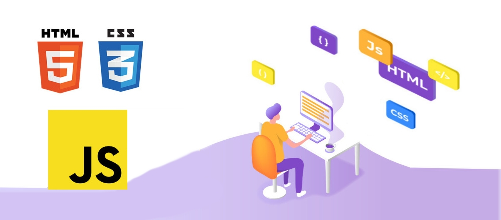

## JavaScript

<kbd></kbd>

JavaScript - самый популярный язык программирования в мире. Считается, что JavaScript не очень сложный язык с низким порогом входа. Но и на его освоение, вместе с сопутствующими технологиями, вам понадобится примерно 1500 часов времени. И это если учиться в напряженном режиме по несколько часов в день. 

Базовые знания по JavaScript включают в себя: 
- знание теории
- умение решать задачи
- умение создавать приложения

#### Теория:
Вам достаточно прочитать и хотя бы частично понять [Современный учебник JavaScript](https://learn.javascript.ru/). Это отличный бесплатный русскоязычный ресурс, который совсем недавно был полностью обновлён. В учебнике есть практические задания, которые очень желательно выполнять.

Если такой старт покажется слишком сложным, начать можно с учебника "JavaScript для детей" автор Ник Морган, предназначенного для детей от 10 лет.

Если хотите начать с изучения Computer Science и есть для этого время, из хороших вводных курсов можно назвать легендарный гарвардский курс [CS50 (Computer Science 50)](https://ru.wikipedia.org/wiki/CS50) и книгу "Грокаем алгоритмы" от Адитья Бхаргава.

Кроме того, есть большое количество видео курсов на YouTube. Выбирая для просмотра курс, обращайте внимание на то, что JavaScript быстро развивающийся язык, и многие курсы устарели, а иногда устарели знания их авторов. 

#### Задачи:
Огромный выбор задач предоставляет бесплатный англоязычный ресурс [Сodewars](https://www.codewars.com/). Задачи группируются по языкам программирования и по уровню сложности - от самых простых задач восьмого уровня до самых сложных - первого. С ростом количества и сложности решённых вами задач, будет расти и ваш уровень тоже.

При регистрации на Сodewars укажите свой username такой же, как и username на GitHub.

Старайтесь решать задачи каждый день, по одной-две задачи в день. После решения задачи откроются решения других участников, присмотритесь к ним. Лучшие практики Сodewars не всегда совпадают с лучшими практиками реальной разработки, но, как правило, это будут оригинальные, современные, краткие и интересные решения. 

#### Проекты
Проекты - самая интересная и увлекательная часть программирования. Большое количество JavaScript-проектов можно найти на GitHub, YouTube, codepen. Основная проблема начинающего разработчика - как отличить проекты с качественным современным кодом от проектов устаревших и некачественных. Можно ориентироваться в первую очередь на автора проекта или название курса. Имена Wes Bos и Andrei Neagoie вызывают доверие и можно быть уверенными, что их код достаточно качественный, чтобы на нём учиться и перенимать лучшие техники.

До старта stage1 рекомендуется выполнить хотя бы несколько проектов бесплатного курса [JavaScript 30](https://javascript30.com/). Автор курса считается одним из лучших преподавателей JavaScript. Он предлагает идею проекта, готовую вёрстку, видеоинструкцию. Всё, что осталось сделать - написать js-код, а если это не удастся сделать самостоятельно, - разобраться как работает код, предложенный автором.

Вне зависимости от того, кто является автором проекта, код всегда можно попробовать изменить и улучшить, добавить в него свои собственные, не предусмотренные автором возможности. Экспериментируйте и старайтесь внести в код что-то своё, это первый шаг на пути к вашим собственным оригинальным приложениям.

## Материалы

- [Основы JavaScript плейлист от Sorax](https://www.youtube.com/playlist?list=PL363QX7S8MfSxcHzvkNEqMYbOyhLeWwem)
- [Основы JavaScript плейлист от loftblog](https://www.youtube.com/playlist?list=PLY4rE9dstrJymG1GyPLgOKsJNq9r-p6pX)
- [EcmaScript - Полный курс (ES6, ES7, ES8)](https://youtu.be/Ti2Q4sQkNdU)
- [Сложный JavaScript простым языком](https://www.youtube.com/playlist?list=PLqKQF2ojwm3l4oPjsB9chrJmlhZ-zOzWT)

## Отдельные темы
- [Настройка рабочего окружения](https://youtu.be/5YW71SBgdBg)
- [How browser works](https://youtu.be/gdriDw-ciH8)
- [Chrome Dev Tools](https://youtu.be/0sDHMq3x4fA)
- [JS Basic. Data types. Arrays](https://youtu.be/w420Ullz2cw)
- [Array.prototype. Part 1](https://youtu.be/5bSBT7aRLQ0)
- [Array.prototype. Part 2](https://youtu.be/UAUxD6Y_IZI)
- [Data Struuctures with JS](https://youtu.be/9WCuoy90fBM)
- [Functions](https://youtu.be/3NG9o6lSEdA)
- [Scope](https://youtu.be/tCFjSMfoPTM)
- [This](https://youtu.be/nAniujU5wUc)
- [Event Loop](https://youtu.be/w7wPSVB-S28)
- [Functions](https://youtu.be/fShrn50Fkhw)
- [[J]u[S]t prototype this!](https://youtu.be/5l01s6Vkqp0)
- [JavaScript для верстальщика](https://github.com/rolling-scopes-school/tasks/blob/master/tasks/stage-0/js-for-frontend.md)

## Проекты
- JavaScript 30
  - [Сайт проекта](https://javascript30.com/)
  - [Репозиторий проекта на GitHub](https://github.com/wesbos/JavaScript30)
  - [Плейлист на YouTube](https://www.youtube.com/playlist?list=PLu8EoSxDXHP6CGK4YVJhL_VWetA865GOH)
- [Build 15 JavaScript Projects](https://youtu.be/3PHXvlpOkf4)
- [17 JavaScript Projects You Can Build to Perfect Your Coding Skills](https://mikkegoes.com/javascript-projects-for-beginners/)
- [JavaScript Web Projects: 20 Projects to Build Your Portfolio](https://www.udemy.com/course/javascript-web-projects-to-build-your-portfolio-resume/)
- [100 JavaScript Projects for Beginners](https://jsbeginners.com/javascript-projects-for-beginners/) 