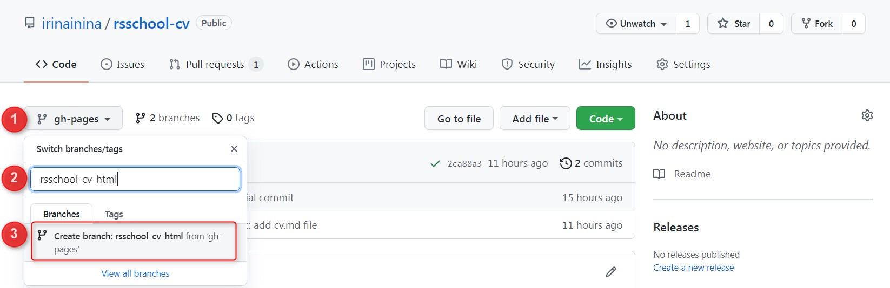
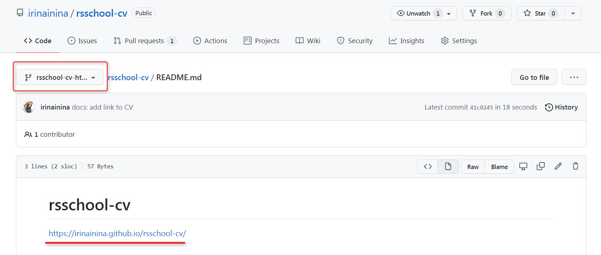
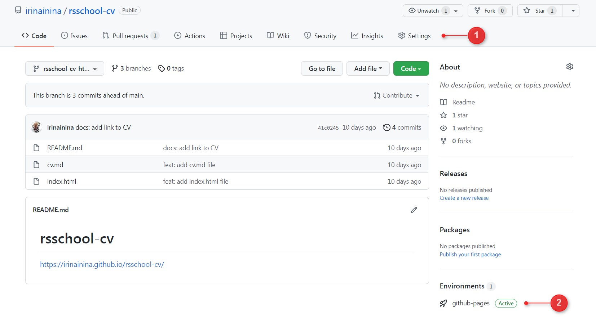
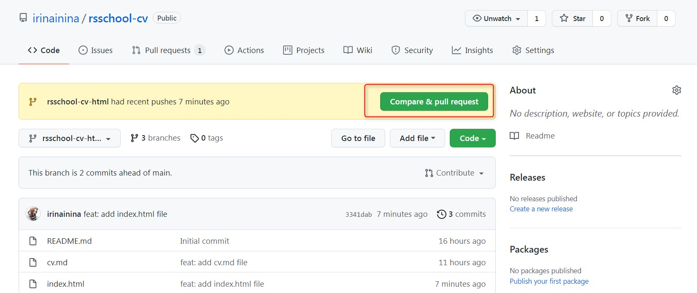
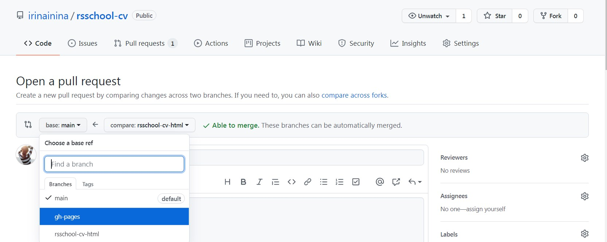
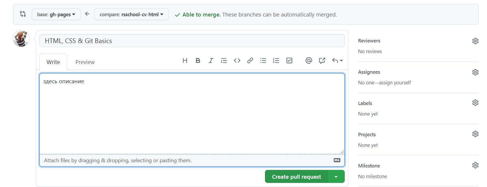
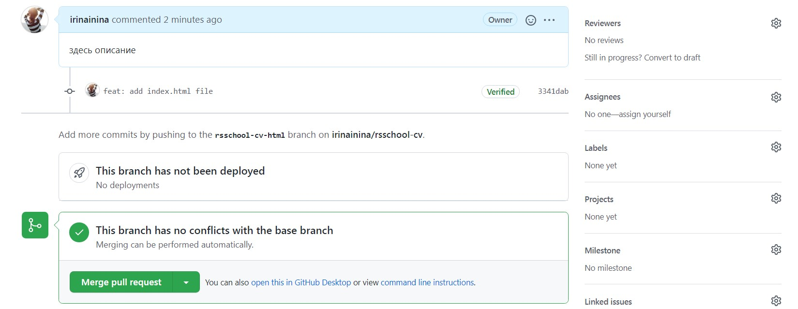
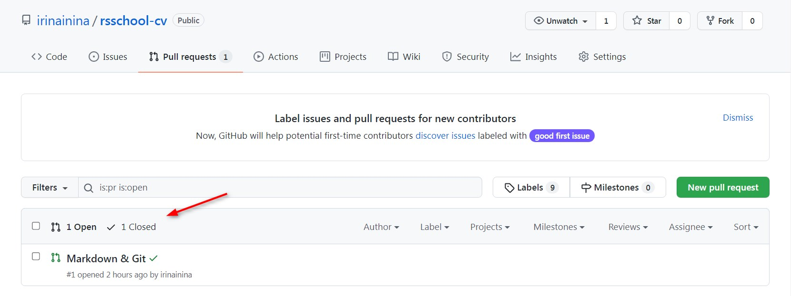
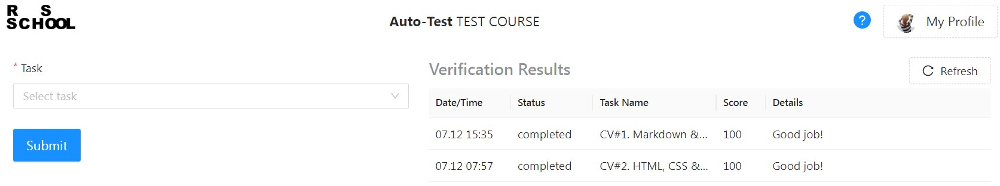

## Советы по выполнению задания СV#2
Описание задания [HTML, CSS & Git Basics](cv2.md)

#### 1. Создаём ветку `rsschool-cv-html`

- Убедитесь, что находитесь в ветке `gh-pages`
- Кликаем на стрелку рядом
- Указываем название ветки, которую хотим создать `rsschool-cv-html`
- Кликаем по надписи `Create branch: rsschool-cv-html from gh-pages`  

Мы создали ветку `rsschool-cv-html` и перешли в неё. В эту же ветку переместились все файлы из ветки `gh-pages`

<kbd></kbd>

#### 2. Добавляем файлы `index.html` и `style.css` в ветку `rsschool-cv-html`

С двумя способами добавления файлов в проект мы уже познакомились раньше.  
В них есть небольшое отличие. GitHub позволяет создать пустой файл, но не позволит пустой файл  загрузить. Именно с этим ограничением связана рекомендация добавить в файлы `index.html` и `style.css` любое содержание, чтобы можно было их загрузить на GitHub  

Будьте внимательны, при добавлении файлов не забывайте указывать названия коммитов используя при этом префиксы.  

#### 3. Ссылка на CV в README.md

Добавляем в файл README.md ветки `rsschool-cv-html` ссылку `https://GITHUB-USERNAME.github.io/rsschool-cv/` в которой вместо `GITHUB-USERNAME` указываем свой никнейм на сайте GitHub.

<kbd></kbd>

Эту ссылку не обязательно составлять вручную, её также можно найти в настройках или на странице репозитория

<kbd></kbd>

#### 4. Создаём Pull Request 

У нас уже есть кнопка `Compare & pull request`, предлагающая создать Pull Request. Кликаем по ней

<kbd></kbd>

По умолчанию GitHub предлагает создать Pull Request в главную ветку репозитория.  
Указываем, что Pull Request создаём из ветки `rsschool-cv-html` в ветку `gh-pages`

<kbd></kbd>

Даём название Pull Request `HTML, CSS & Git Basics`, добавляем описание, нажимаем на кнопку `Create pull request`

<kbd></kbd>

#### 5. Merge Pull Request

Чтобы замержить Pull Request, необходимо нажать на кнопку `Merge pull request`, а затем `Confirm merge`

<kbd></kbd>

При этом все файлы из ветки `rsschool-cv-html` копируются в ветку `gh-pages`

Сам Pull Request при этом закрывается, но не исчезает. Увидеть его можно на вкладке `Closed`

<kbd></kbd>

#### 6. Отправляем работу на проверку

Пройдите по ссылке https://app.rs.school/  
Выберите вкладку `Auto-Test`  
Выберите задание `CV#2. HTML, CSS & Git Basics`  
Нажмите синюю кнопку `Submit` внизу.  

<kbd></kbd>